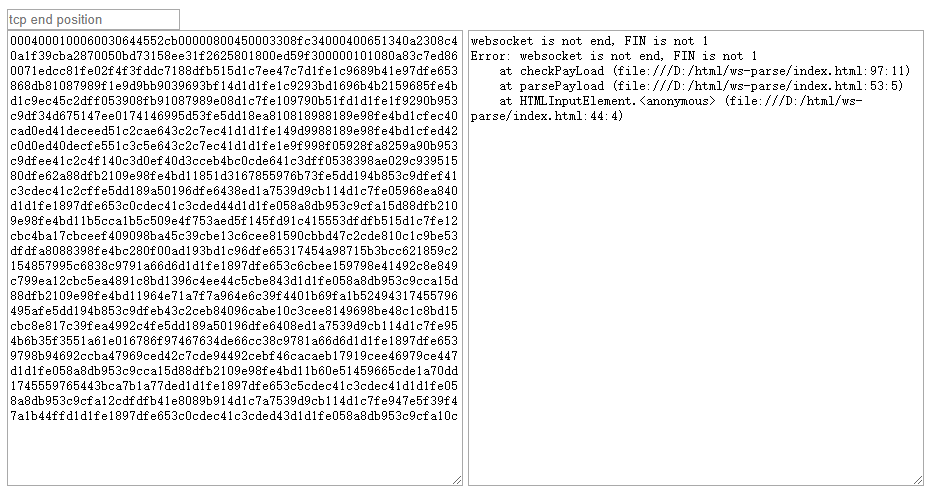

# websocket-dump-parse
parse websocket dump payload

# 前提

对 websocket 链接进行抓包，需要从 websocket 握手开始抓， wireshake 才能解析出正确的协议。
而在 websocket 中途抓包，wireshake 只会显示 tcp 协议，并且无法知道传输的内容。

# 使用说明

可以根据 websocket 协议帧来解析其中的内容。
打开 index.html，将抓到的 tcp 包拷贝为 hex stream，粘贴进网页左边大框。

查看 websocket 报文的开始位置。

将鼠标放在 Transmission Control Protocol 上，报文会高亮，后面的 81 就是 websocket 的开始位置。

把开始位置输入左上角的输入框就能得到这次 websocket 的信息。

其中包括此次 websocket 是否使用掩码以及掩码的值，websocket payload 的长度和 payload 转为 utf-8 字符串的值。 
